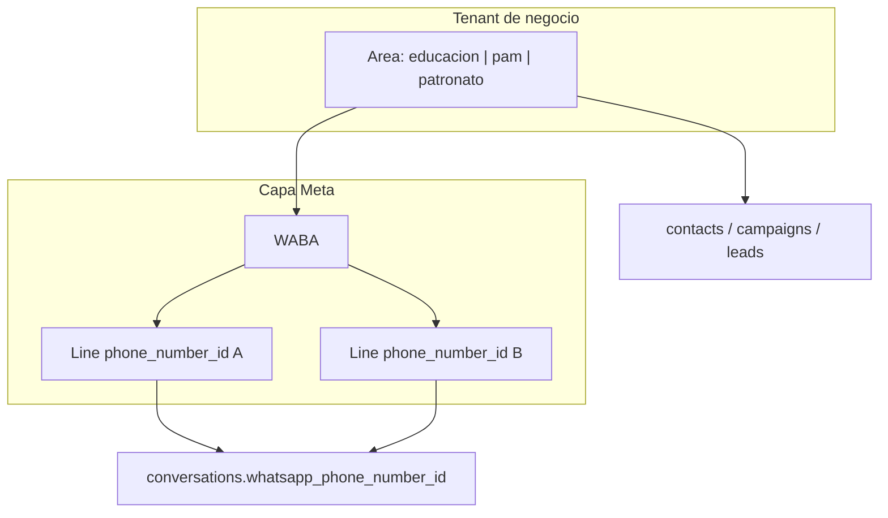

# Modelo: Área + WABA + Línea (no solo WABA)

Documento de decisión / hoja de ruta. Relacionado: [CRM-API.md](./CRM-API.md), [LEADS-ESTADO.md](./LEADS-ESTADO.md), [ROLES-PERMISOS.md](./ROLES-PERMISOS.md).

## Veredicto corto

**Sí conviene mejorar el modelo. No conviene agrupar el producto “por WABA en lugar de por línea”.**

- **Área** = tenant de negocio (PAM, Educación, Patronato): contactos, permisos, CRM ↔ MALI ONE.
- **WABA** = cuenta Meta: plantillas, `subscribed_apps`, facturación, token compartido.
- **Línea** (`phone_number_id`) = canal de envío/recepción; N líneas pueden vivir bajo **una misma área** y **una misma WABA**.

La decisión inicial (1 área ≈ 1 línea) **no fue mala de producto** para un MVP. Lo costoso fue el parche: inventar `educacion_ca` / `educacion_ep` como “áreas” solo porque el schema asumía 1 PID por área. Eso mezcla **programa comercial** con **infraestructura Meta**.

Hoy el CRM ya habla por `area` ([CRM-API.md](./CRM-API.md): `pam`, `educacion_ep`, …). Unificar MALI ONE no exige un cliente API distinto por línea; exige un **tenant de negocio estable**.

## Qué hay hoy (acoplamiento)

- Tenant = string `area` en casi todo (`api/src/config/areas.ts`).
- Credenciales Meta en `app_settings` **1 PID + 1 token + 1 waba_id por área** (`api/src/meta-settings/`).
- Webhook: primero `phone_number_id` → área; fallback WABA ambiguo si varias áreas comparten WABA (`api/src/webhook/webhook-area.util.ts`).
- Educación ya tiene **3 tenants** (`educacion`, `educacion_ca`, `educacion_ep`) con Page token duplicado; Instant Forms se separan por `form_id`, CTWA por línea ([LEADS-ESTADO.md](./LEADS-ESTADO.md)).

Si se “agrupa solo por WABA” como tenant: se rompe aislamiento de contactos PAM vs Educación (si algún día compartieran infra), plantillas keyed por área, y el contrato CRM que MALI ONE ya usa.

## Enfoque recomendado (3 capas)

| Capa | Responsabilidad | Ejemplo Educación |
|------|-----------------|-------------------|
| **Área de negocio** | Identidad de persona, permisos, CRM, campañas, leads | `educacion` (una sola) |
| **WABA** | Sync plantillas, suscripción webhook apps | 1 WABA Educación |
| **Línea WA** | Inbound/outbound, CTWA, `conversations.whatsapp_phone_number_id` | 3 PIDs bajo esa área |
| **Programa** (CA/EP) | Segmento, atributo u origen — **no** área | `programa=ca\|ep` en origen/attrs |

Para PAM: área `pam` + 1 línea (hoy) + CRM ya alineado. Educación se alinea al **mismo patrón** sin un “CRM Educación” separado por línea.

## Coste realista

| Fase | Esfuerzo | Qué desbloquea |
|------|----------|----------------|
| **A — Modelo de líneas (sin fusionar CA/EP)** | Medio (~1–2 sprints) | Varias líneas por área; Admin Meta; webhook PID→área (área ya no = PID); outbound elige línea |
| **B — Entidad WABA explícita** | Bajo–medio (puede ir con A) | Un token/WABA compartido; sync plantillas una vez; deja de duplicar `waba_id` |
| **C — Fusionar `educacion_*` → `educacion`** | Alto (datos + UX) | Una persona Educación; CRM MALI ONE con `area=educacion`; programas como metadata |
| **D — Contrato CRM unificado** | Bajo si C hecho; medio si no | MALI ONE llama siempre `area` de negocio; no N clientes por línea |

**No hace falta C para empezar Educación en MALI ONE:** el contrato actual ya acepta `area: "educacion_ep"`. C es deuda de producto (personas duplicadas entre CA/EP), no bloqueo de integración.

## Plan de implementación

### Fase A+B (prioridad técnica)

1. Introducir tabla (o settings) **`whatsapp_lines`**: `area`, `phone_number_id`, `display_phone`, `waba_id` (o FK a `wabas`), `token` (o heredar del WABA), `is_default`, `label`.
2. Resolver inbound **solo por PID → área** (el fallback WABA solo si 1 área posee esa WABA).
3. Outbound / campañas: línea default del área o línea de la conversación (ya existe `whatsapp_phone_number_id` en conversaciones).
4. Admin Meta: editar N líneas por área; WABA compartido.
5. Migrar settings actuales 1:1 a filas de línea (sin cambiar slugs de área todavía).

### Fase C (prioridad de producto, cuando toque unificar Educación)

1. Decidir mapping: contactos/conversaciones/campañas de `educacion_ca` / `educacion_ep` → `educacion`, con `programa` / segmento / origen preservado.
2. Merge de personas por phone/dni/email **dentro** del área unificada.
3. Actualizar rutas Instant Form → siempre `educacion` + metadata de programa.
4. Usuarios `user_areas`: colapsar a `educacion`.
5. CRM: documentar `area=educacion` como canónico; deprecar `educacion_ca` / `educacion_ep` en el contrato.

### Qué no hacer

- Reemplazar `area` por `waba_id` como tenant de contactos/CRM.
- Crear un cliente MALI ONE distinto por cada línea WA.
- Inbox multiárea combinado (ya fuera de alcance en [ROLES-PERMISOS.md](./ROLES-PERMISOS.md)); multi-**línea** dentro de un área sí.

## Checklist

- [ ] Fase A+B: modelo `whatsapp_lines` + WABA compartido; webhook/outbound por PID; migrar `app_settings` 1:1
- [ ] Fase C (cuando se decida): fusionar `educacion_ca` / `educacion_ep` → `educacion` con programa como metadata + merge de contactos
- [ ] CRM MALI ONE Educación: usar área de negocio (hoy `educacion_*`; luego `educacion` canónico) sin un cliente por línea

## Respuesta directa

| Pregunta | Respuesta |
|----------|-----------|
| ¿Buen enfoque agrupar por WABA y por área? | **Área + líneas; WABA como contenedor Meta.** No WABA como único eje. |
| ¿Mala decisión de producto? | **MVP OK; el error fue modelar CA/EP como áreas.** |
| ¿Cómo se resuelve? | Capas + migración por fases; CRM puede seguir con slugs actuales hasta fusionar. |
| ¿Costoso? | **A+B medio; C alto** (migración de datos). Integrar Educación en MALI ONE **sin** fusionar es barato. |
